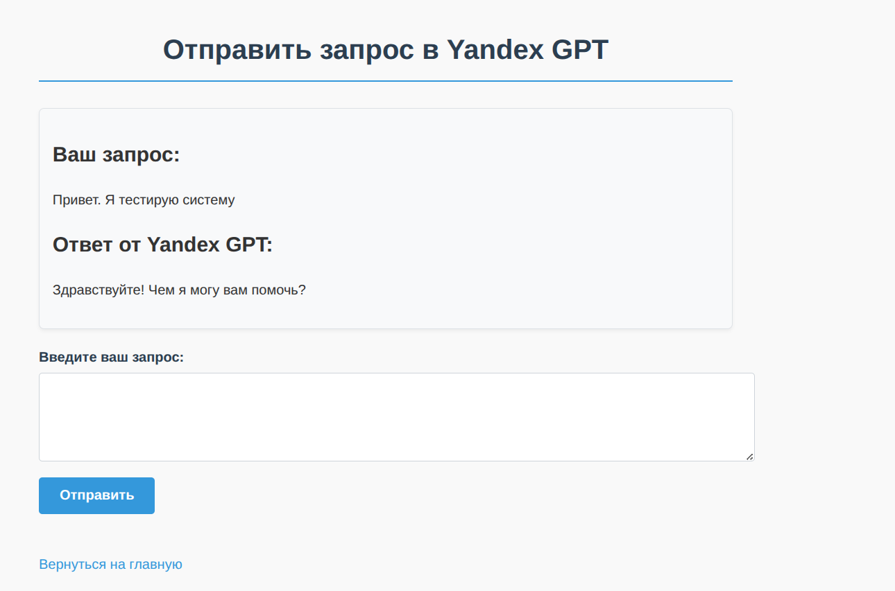

# MaxApp

Приложение для мессендежра Max. (позже сделаем подробнее описание)

# Manager GPT

Это класс, который имеет необходимый функционал для работы с нейросетью Yandex GPT и обработки его ответов. Из файла `.env` - достается API ключ необходимый для взаимодействия с нейросетью. Сам запрос отправляется в функции `ask_yandex_gpt`.   В данной функции есть `promt` и `headers`.

В `headers` передается API ключ. 
```
headers = {
                "Authorization": f'Api-Key {YANDEX_API_KEY}'
        }
```

В `promt` есть задаваемы настройки для нейросети. Например, `maxTokens` - максимальное количество токенов, которое может генерировать нейросеть. `temperature` - процент уникальнасти, которая определяет, как нейросеть будет генерировать ответ.

Под ключом `messages` можно передават сообщения. Можно назначить несколько ролей. Чаще используют две роли `system` и `user`. В `system` передается информация для нейросети. Например, на какие темы отвечать ли нет, что отвечать или сама информация по которой нейросеть будет отвечать. Например, я могу задать ограничение, чтобы нейросеть не отвечала на вопросы 18+. В `user` передается пользовательское сообщение, которое нужно отправить нейросети.

```
promt = {
        "modelUri": "gpt://b1gepobpgb2dkh94rn42/yandexgpt",
        "completionOptions": {
            "stream": False,
            "temperature": 0.6,
            "maxTokens": "2000",
            "reasoningOptions": {
            "mode": "DISABLED"
            }
        },
        "messages": [
            {
            "role": "system",
            "text": system_text
            },
            {
            "role": "user", 
            "text": request
            }
        ]
    }  
```

Возвращается ответ от нейросети и даьше обрабатывается в `parser_response_gpt`.  Сам ответ выходит в виде json. Под ключом `result` будет храниться ответ от нейросети. Но также там могут быть сообщения об ошибках. Однако ответ возвращается визуально в виде json, а по факту строкой, поэтому парсер парсит ответ в json и обрабатывает.

Пример работы на фото:



# DataBaseManager

Класс для работы с базой данных. В ней есть функция `_connect` которая устанавливает соединения с базой данных по информации, что также извлекается из файла `.env`. В `os.getenv()` передается имя переменной, которую нужно получить. По этой переменной в `.env` храниться соответсвующая информация. 

`query_database` - функция для запроса к базе данных. В нее передается запрос, который нужно выполнить, параметры и такой флаг, как reg. Этот флаг нужен для того, чтобы указать, что мы не ожидаем ответа от запроса.  Например, команда `INSERT`. Иначе будут ошибки
